###### Developing-Grade-sheeet-using-python

### Introduction

In this Project We tried to built a gradesheet using python. We did it in Jupyter notebook. In this project I tried to build up student grade report and the analysis
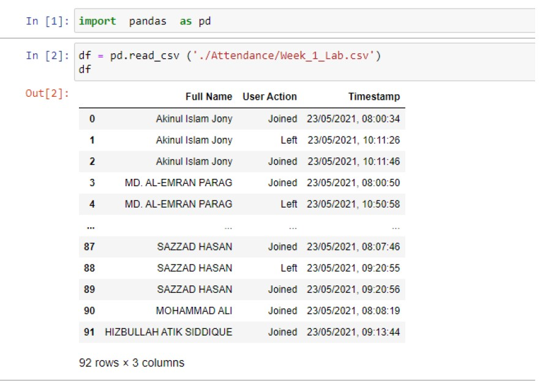
 
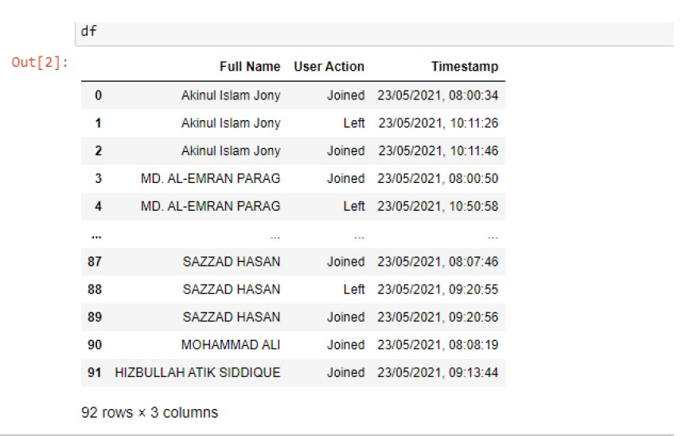
 
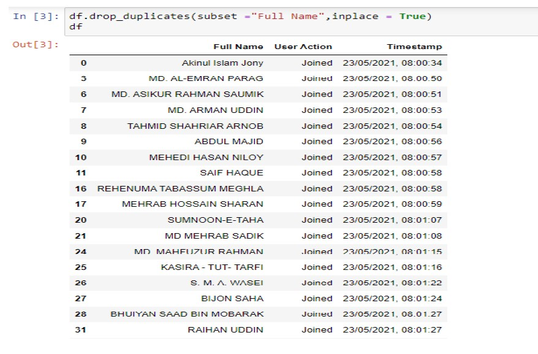
 
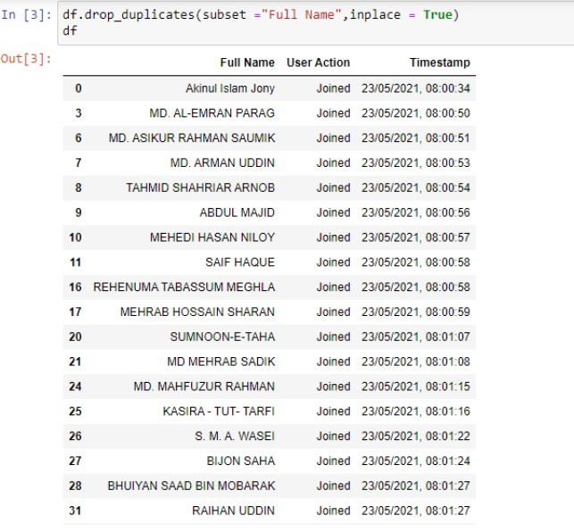
 
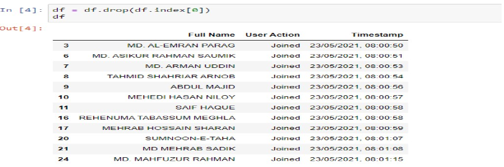
 
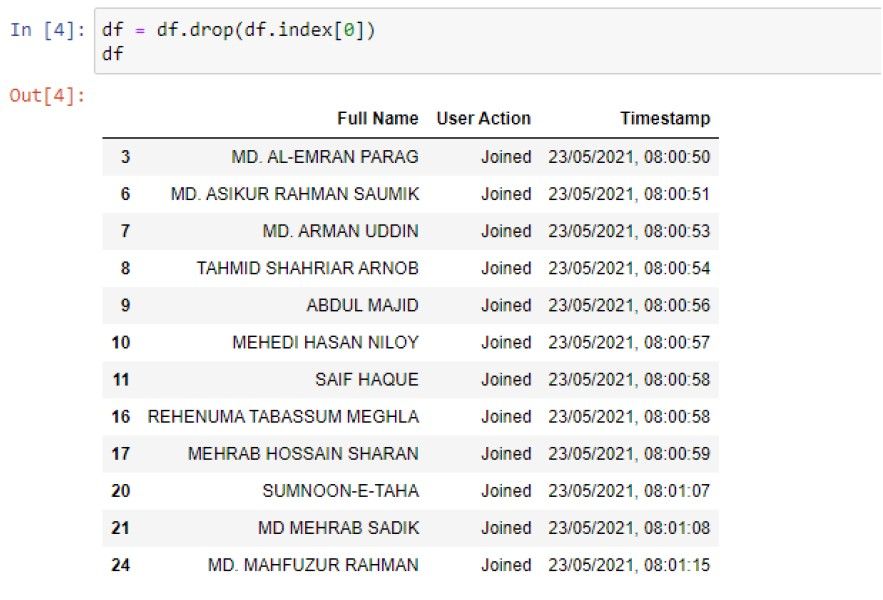
 
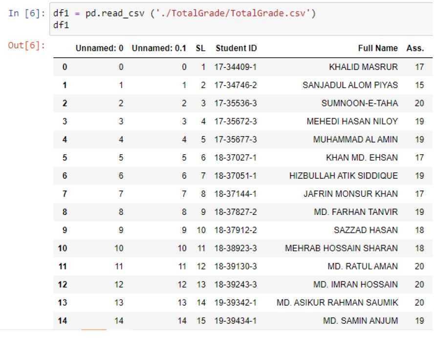
 

### Grade Analysis

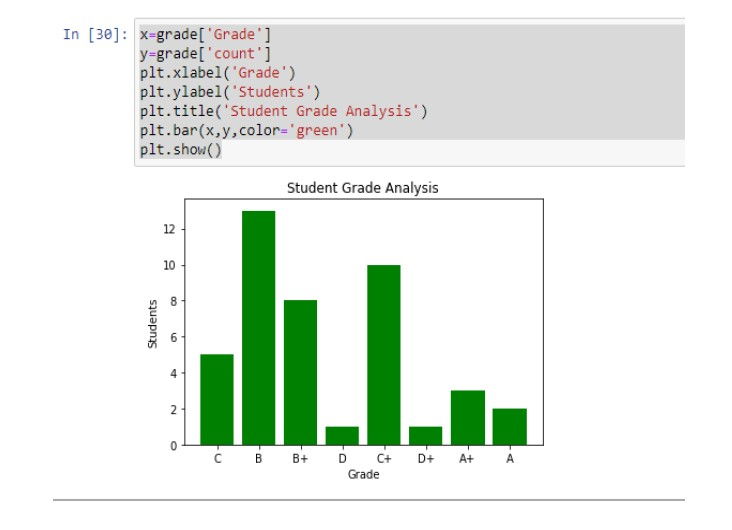
 
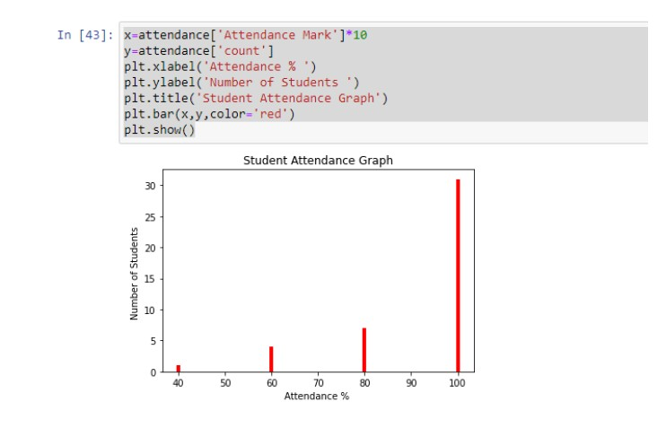
 
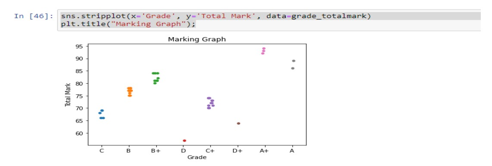
 
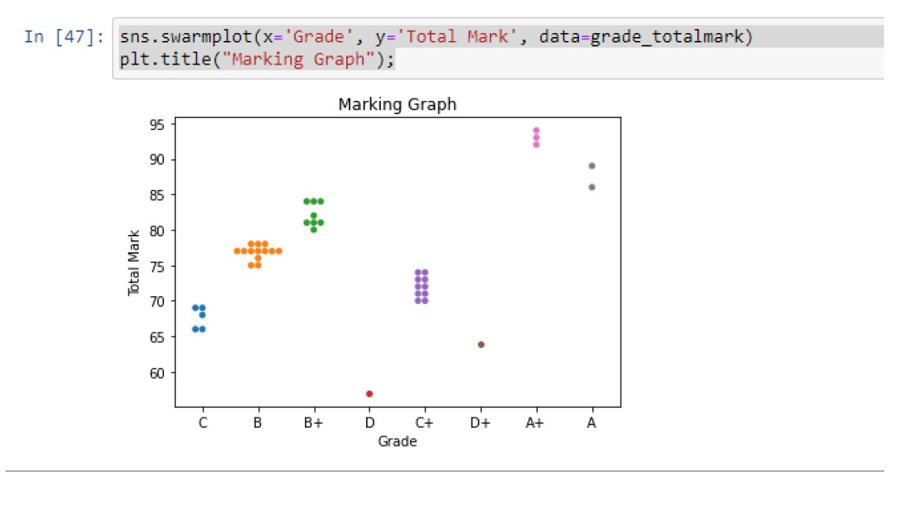
 
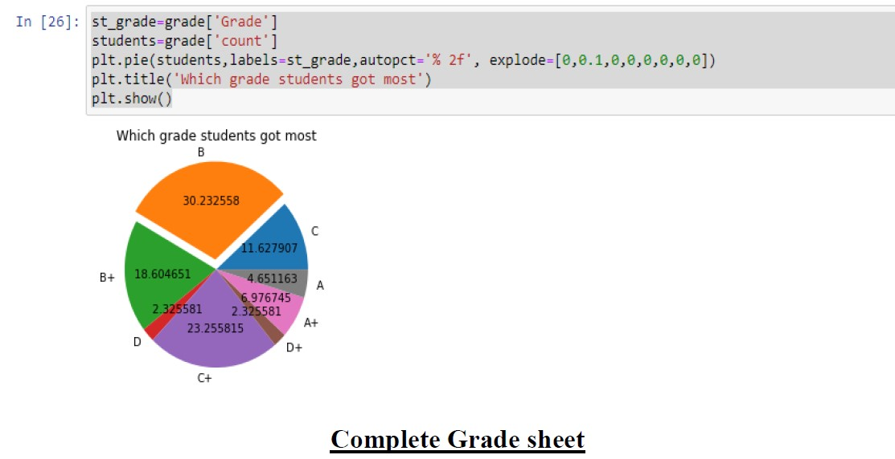
 

### Final Grade Sheet

 
